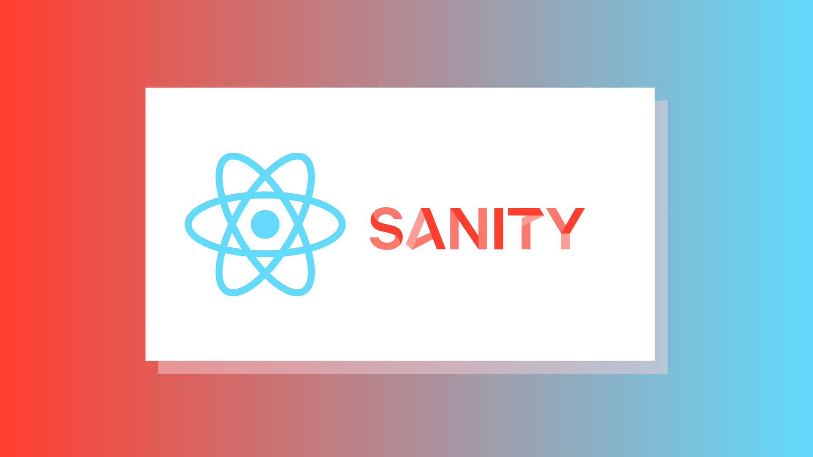

# React.js + Sanity Portfolio

A personal portfolio and blog built with React, Vite and Tailwind CSS. Content (author bio, projects and blog posts) is fetched at runtime from the [Sanity](https://www.sanity.io/) Content Lake.



## Pages

| Route | Content |
|---|---|
| `/` | Landing page |
| `/about` | Author name, photo and bio (`author` documents) |
| `/project` | Project cards with tags (`project` documents) |
| `/post` | Blog post list (`post` documents) |
| `/post/:slug` | A single blog post |

## Getting started

Requirements: Node.js 24 (see `engines` in `package.json`) and npm.

```bash
npm install
npm run dev       # start the Vite dev server
npm run build     # production build into dist/
npm run preview   # serve the production build locally
npm run lint      # ESLint
```

## Sanity configuration

The Sanity project and dataset are set in [`src/client.js`](src/client.js). The dataset must be public (the site uses no token). The site expects these document types:

- `author`: `name`, `bio` (block content), `image`
- `project`: `title`, `date`, `place`, `description`, `projectType`, `link`, `tags`, `mainImage`
- `post`: `title`, `slug`, `mainImage`, `body` (block content), `author` (reference to `author`)

The Sanity Studio schemas are not part of this repository.

## Deployment

Client-side routes (e.g. `/about`) need every path to fall back to `index.html`: `vercel.json` does this on Vercel and `public/_redirects` on Netlify-style hosts.
